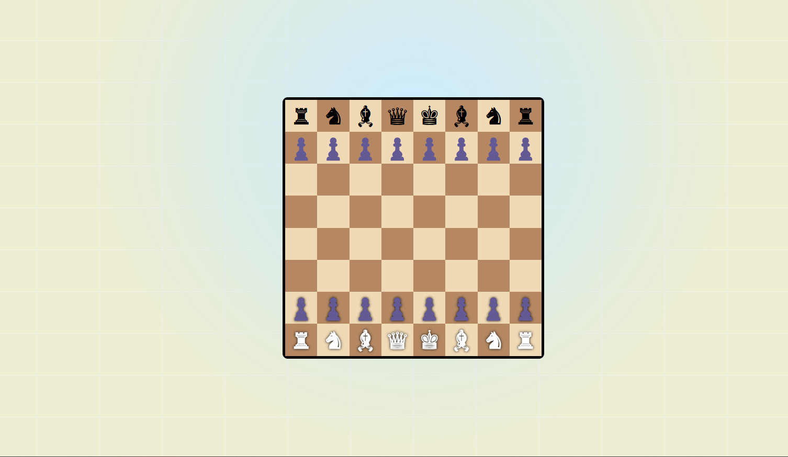

# Custom-Chess-Game ♟️

  
🏁*A customizable chess game built using Node.js, JavaScript, and EJS.*

## 📌 Project Overview
Custom-Chess-Game is an interactive chess game designed to be played in a web browser. It is built using **Node.js** for the backend and **EJS** for templating. The project provides a clean and responsive UI with customizable chess game features.

## 🚀 Features
- Multiplayer support
- Customizable chess rules
- Interactive UI with real-time updates
- Smooth animations and move validation
- Easy-to-deploy Node.js backend

## 🏗️ Project Structure
```
Custom-Chess-Game/
│── Demo/                 # Contains screenshots and demo images
│── node_modules/         # Node.js dependencies
│── public/js/            # Frontend JavaScript files
│── views/                # EJS template files
│── app.js                # Main backend file (Node.js)
│── package.json          # Project dependencies and metadata
│── package-lock.json     # Lock file for dependencies
```

## 📸 Demo
Here are some screenshots of the game in action:


## 🛠️ Installation & Setup
To run this project locally, follow these steps:

### 📋 Prerequisites
Ensure you have **Node.js** installed on your system.

### ╰┈➤ Steps
1. Clone the repository:
   ```sh
   git clone https://github.com/Devkumar-web/Custom-Chess-Game.git
   ```
2. Navigate to the project folder:
   ```sh
   cd Custom-Chess-Game
   ```
3. Install dependencies:
   ```sh
   npm install
   ```
4. Start the server:
   ```sh
   node app.js
   ```
5. Open your browser and go to:
   ```sh
   http://localhost:3000
   ```

## 🤝 Contributing
Contributions are welcome! Feel free to fork this repository, submit pull requests, or open issues.

## 📄 License
This project is open-source and available under the **MIT License**.

---
### 🔗 Connect with Me
GitHub: [Devkumar-web](https://github.com/Devkumar-web)

